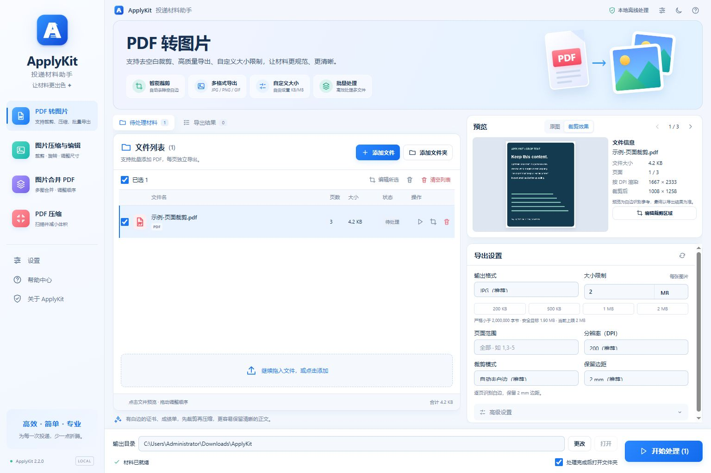

<div align="center">
  
  <h1>ApplyKit · 投递材料助手</h1>
  <p>裁剪、转换、压缩，把材料整理到招聘网站要求的大小。</p>
  <p>Windows 10 / 11 x64 · 本地处理 · 保留原件 · 免安装</p>
</div>



## 下载与使用

从 [Releases](https://github.com/augety121/ApplyKit/releases) 下载 `ApplyKit_Windows_x64_v2.2.0.zip`，完整解压后双击 `ApplyKit.exe`。

1. 选择工具，添加文件、文件夹，或直接拖入材料。
2. 点击文件查看预览；需要时编辑裁剪、旋转或翻转。
3. 设置格式、KB / MB 上限和输出目录，开始处理。
4. 在“导出结果”中查看实际大小、失败原因，放大检查成品。

首次打开可点击 **“载入示例，体验完整流程”**。示例是软件内置的合成测试材料，不含个人数据。

运行需要 Microsoft Edge 或 Google Chrome 承载独立应用窗口；PDF 使用 Windows PowerShell 5.1 和系统 `Windows.Data.Pdf`。成品不需要安装 Go、Python 或 Node.js。

## 2.2.0 更新

- 浅蓝白桌面工作台：工具导航、文件表格、右侧预览与设置、固定底部操作栏。
- 队列与导出结果切换显示；提供单文件处理、状态提示、键盘预览和失败重试。
- 自动去白边显示实际识别预览；PDF 边距可选 0 / 1 / 2 / 5 / 10 / 20 mm，并保存设置。
- 首次启动保留默认输出目录；切换材料、清空队列时取消过期预览。
- 修复旋转加翻转的预览方向，以及 PDF 点单位到 DPI 像素的换算。
- 处理期间锁定队列和输出设置；保留失败/取消状态，连接暂时中断时重新连接当前任务。
- 完整深色主题、紧凑桌面布局，以及“关于 ApplyKit”窗口。

## 工具

| 工具 | 能力 |
| --- | --- |
| PDF 转图片 | JPG / JPEG / PNG / 静态 GIF；150 / 200 / 300 DPI；页码范围；自动、统一或手动裁剪 |
| 图片压缩与编辑 | 压缩、自由及固定比例裁剪、旋转、翻转、去白边、最长边、格式转换 |
| 图片合并 PDF | 按队列顺序合并；A4 或贴合图片；限制整份文件大小 |
| 扫描 PDF 压缩 | 逐页图像重建；保持页数；压缩结果不增大 |

大小可以输入 **1 KB～100 MB**，包括 `200 KB`、`500 KB`、`0.8 MB`、`1.5 MB`。1 KB = 1,000 bytes，1 MB = 1,000,000 bytes，输出必须严格小于上限。编码通常以 95% 为安全目标；无法满足清晰度底线和大小要求时明确报错。

每次导出新建目录，原材料不会被覆盖。纯压缩无法继续缩小且原文件已达标时，结果会标为“保留原件”。

## 构建与验证

源码要求 Go 1.23+；CI 使用 Go 1.26。仅依赖 Go 标准库。

```powershell
./build.ps1
node --test tests/geometry.test.mjs
powershell.exe -NoLogo -NoProfile -STA -ExecutionPolicy RemoteSigned -File ./tools/windows_smoke.ps1
./tools/package.ps1
```

输出 `dist/ApplyKit.exe` 与 `dist/ApplyKit_Windows_x64_v2.2.0.zip`。默认不生成校验和清单。`build.ps1` 会执行 Go 测试和 `go vet`；前端修改后还应执行：

```powershell
node --check web/app.js
node --check web/ui.js
node --check web/editor.js
```

GitHub Actions 在 Linux / Windows 上检查核心代码，并在 Windows 上执行真实 PDF 和图片验收。版本标签 `v2.2.0` 触发构建与 Release 发布。普通用户可运行软件包中的 `运行自检.cmd`；不需要开发环境。

实际验证记录和边界见 [验收说明](docs/ACCEPTANCE.md)，开发结构见 [架构说明](docs/ARCHITECTURE.md)。

## 限制与隐私

材料只在 `127.0.0.1` 上与本地引擎交换，不上传互联网。每次启动使用随机端口与会话认证；正常关闭清理本次工作缓存，输出文件由用户保留。

扫描 PDF 压缩与图片合并生成图像型 PDF，**不保留可搜索文本、表单、链接或数字签名**。不支持 OCR、扫描纠偏、动态 GIF。自动裁剪预览是参考；统一裁剪的最终范围由所选页内容并集决定。导出前后请检查小字、姓名、编号和印章。

单个输入最多 250 MB，图片最多 3200 万像素，每批最多 200 个文件，单 PDF 最多 200 页。Windows 应用窗口使用系统浏览器内核，软件包没有内置 WebView2。

## 许可

[MIT](LICENSE) · [第三方说明](THIRD_PARTY_NOTICES.txt) · [English](README.en.md)
